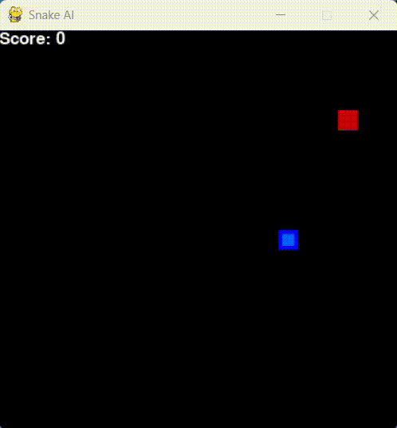

# 🐍 SnakeAI

This project implements artificial intelligence for the classic game "Snake" using the **Deep Q-Learning** algorithm.
The **goal** is to teach the agent to play the game by optimising its strategy through reinforcement learning so that it can avoid obstacles and collect food.



## 📋 Project overview

The project uses the **Deep Q-Learning** algorithm to train the AI model. The agent perceives the state of the game (danger, direction, food location) and, based on the knowledge gained, decides which move is best.

- **Programming language:** Python 3.11
- **Technologies:** PyTorch, Pygame, Matplotlib
- **Algorithm:** Deep Q-Learning (DQN)
- **Game environment:** Pygame-based game shell.

### Features

* **Reinforcement learning:** agent learns unsupervised, receiving rewards for successful actions.
* **Deep learning network:** a feedforward neural network is used to approximate the Q-function.
* **Experience Replay:** the agent stores its gaming experiences in a memory buffer to learn more effectively from past games.
* **Epsilon-Greedy:** balance between exploration (random moves) and exploitation (choosing the best move based on the model).
* **Saving the best model:** model is automatically saved every time the agent sets a new record.
* **Resuming training:** training progress (including optimiser state, number of games, and epsilon) is saved, allowing you to resume training from where you left off.
* **Visualisation:** learning progress is visualised and saved as a graph.

## 📊 Results

- **Learning progress chart:**
  

## 📂 Project structure

```
SnakeAI/
├── agent.py # Agent logic (state retrieval, decision making, memory)
├── main.py # Main script that starts the training cycle
├── model.py # Neural network and trainer definition
├── plotter.py # Functions for visualising and saving graphs
├── snake_game.py # Game environment on Pygame
├── model/
│ └── model.pth # Saved weights of the trained model
├── plots/
│ └── training_progress.png # Saved training progress graph
└── requirements.txt # List of dependencies
```

## 🚀 How to get started

1. Clone the repository:

```bash
git clone https://github.com/LarLex001/SnakeAI.git
cd SnakeAI
```

2. **Install dependencies:** Make sure you have Python 3.11 installed. Then install the necessary libraries:

```bash
pip install -r requirements.txt
```

3. Start the game and training:

```bash
python main.py
```

## 📝 Licence

This project is licensed under the MIT License. For details, see the [LICENSE](LICENSE) file.